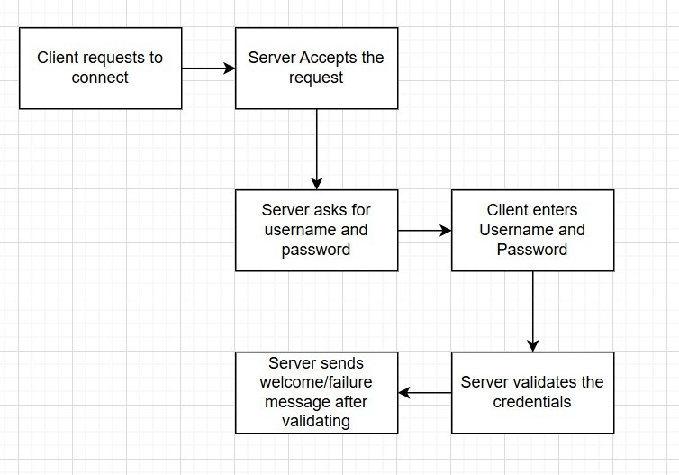
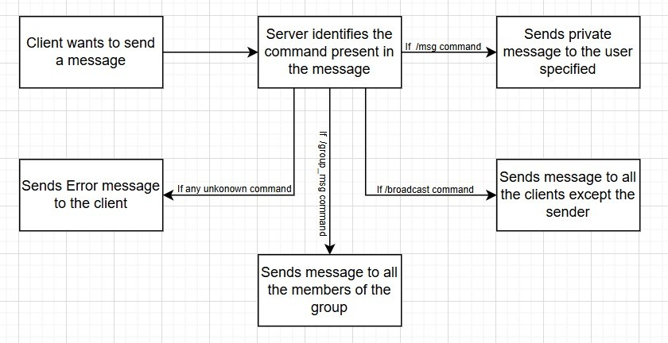

# Multi-threaded Chat Server in C++

**Group Members:**  

\- Divyansh Mathur (210357)  
\- Parv Chhabra (210706)  
\- Ravi Kumar (210833)

This is a multi-threaded chat server implemented in C++ that supports private messages, group chats, and broadcasting functionalities.
First, we create the `server_grp.cpp` file, containing the implementation of all the functionalities like private messaging, group messaging, broadcasting etc.
To compile and run the server we use the `make` command
```bash
$ make
```
- First, we open the terminal and navigate to the “A1” directory.
- Then we run make to compile the server.
- This command triggers the Makefile and compile `server_grp.cpp` into an executable named server_grp.
- After a successful build, we run the server with the command: `./server_grp` in the terminal we see followings message
```bash
$ ./server_grp
Server is running on port 12345
```

## Explanation and working of the file `server_grp.cpp`

The flow of the chat server code is designed to handle multiple clients efficiently through multi-threading. Here’s a step-by-step explanation of how the flow of execution works, from the server initialization to client interaction:

### Server Initialization

**1. Create Server Socket:** The server starts by creating a socket using `socket(AF\_INET, SOCK\_STREAM, 0)`. This socket will serve as the communication channel between the server and the clients. The `AF\_INET` indicates that the server is using IPv4 addresses, and `SOCK\_STREAM` specifies that it's a TCP socket, meaning reliable, stream-based communication.

**2. Set Up Server Address:** The server binds the socket to a specific IP address and port using the `bind()` function. The IP address typically is `INADDR\_ANY`, which means the server will accept connections on any available network interface. The port number is 12345, which is the port the server will listen on for incoming client connections.

**3. Start Listening:** The server enters listening mode with `listen()` and specifies a queue size of 1000. This means that the server can handle up to 1000 pending connections before rejecting any new connection attempts. It prepares to accept new clients.

**4. Main Server Loop:** The server enters an infinite loop `while(true)`, constantly waiting for new connections from clients. It listens for incoming client connections using `accept()`, which blocks until a client connects.

### Accept Client Connections

**1. Waiting for Clients**: As clients attempt to connect, the server invokes `accept()` to accept the incoming connection. Each client connection results in the creation of a new socket, which is used for communication with that particular client.

**2. Authenticate Client**: After a successful connection, the server prompts the client to send its username and password. These credentials are checked against the users map, a data structure that holds the usernames and their corresponding passwords. If the credentials are invalid, the server sends an error message and closes the connection.

**3. Add Client to List**: If the client successfully authenticates, their socket and username are added to the clients map. This map keeps track of all currently connected clients. The key is the client's username, and the value is the socket used for communication.

### Handling Multiple Clients with Threads

**1. Spawning a Thread**: The server creates a new thread for each client using `std::thread(handle\_client, client\_socket)`. This allows the server to handle each client independently and concurrently, ensuring the server can support multiple clients without blocking on one client.

**2. Thread Detachment:** After the thread is created, the server immediately detaches it using `.detach()`. This means that the thread will continue running in the background, and the server can continue accepting new connections without waiting for the thread to finish.

### Client Communication (Handle Client)

**1. Reading Client Messages:** The server listens for messages from each client using `recv()`. This function blocks, meaning the server waits until a message is received from the client. The message is then processed by the server to determine the appropriate action.

**2. Process Commands:** Depending on the message received, the server interprets it as one of the following types of commands:

- **Private Message(`/msg username message`):**  The server checks if the recipient username exists in the clients map. If found, the message is sent to the corresponding client's socket. If not found, the server sends an error message to the sender.

- **Broadcast Message(`/broadcast message`):** The server iterates over the clients map, excluding the sender, and sends the message to all connected clients

- **Group Messaging(`/group message`):** The server checks if the sender is part of the group (based on the groups map). If the sender is a member of the group, the server sends the message to all other members of that group.

- **Create/Join/Leave Groups:** Clients can manage groups with the following commands:
  - `/create\_group group\_name`: The server creates a new entry in the groups map with the group name and an empty member list.
  - `/join\_group group\_name`: The server adds the client to the specified group's member list.
  - `/leave\_group group\_name`: The server removes the client from the group’s member list.
  
- **Exit/Disconnect(`/exit`):** If a client wants to disconnect, they can send the /exit command. The server removes the client from the clients map and closes their socket.

### Messaging Details

**1. Private Messages:** When sending a private message, the server looks up the recipient's username in the clients map. If the recipient exists, the server sends the message only to that client. If not, an error message is sent back to the sender.

**2. Broadcast Messages:** For broadcast messages, the server loops through the clients map, excluding the sender. The message is sent to all other connected clients using their respective sockets.

**3. Group Messaging:** When a message is directed to a group, the server verifies if the sender is part of the group. The groups map is checked to ensure the sender’s username exists in the group’s member list. The server then sends the message to all members of the group except for the sender.

### Group Management

**1. Create Groups:**  When a client sends the `/create\_group group\_name command`, the server creates a new entry in the groups map. The group is initialized with an empty member list, indicating that no clients are yet members of the group.

**2. Join Groups:** If a client wants to join a group, they send the `/join\_group group\_name` command. The server checks if the group exists in the groups map. If it does, the client's username is added to the group's member list.

**3. Leave Groups:** When a client wants to leave a group, they send the `/leave\_group group\_name` command. The server removes the client's username from the group's list of members in the groups map.

**4. Group Messages:** When sending a message to a group, the server checks if the sender is part of the group by checking the groups map. If the sender is a member, the message is sent to all group members, excluding the sender.

### Client Disconnection and Cleanup

**1. Disconnecting:** When a client disconnects (either by sending the `/exit` command or due to an error), the server removes the client from the clients map and sends a notification to the other clients, informing them that the client has disconnected.

**2. Close Client Socket:** The server ensures that the client's socket is properly closed by calling close(`client\_socket`). This releases the resources allocated to the connection, ensuring that the system is not holding onto unused sockets.

### Multithreading and Synchronization

**1. Threaded Execution:** Each client is handled in a separate thread using std::thread. This allows the server to manage multiple clients concurrently. Each thread processes a client's messages and commands independently of other clients.

**2. Mutex for Synchronization:** Since multiple threads might need to access shared data structures like the clients and groups maps, the server uses std::mutex to synchronize access to these maps. The mutex ensures that only one thread can modify the data structures at a time, preventing race conditions.

### Server Termination

**1. Running the Server:** The server runs indefinitely, continuously accepting new clients, processing their messages, and managing groups. The server remains active until it is manually terminated.

**2. Cleanup on Termination:** When the server is manually terminated, it ensures that all threads are joined or detached properly, and that all open connections and sockets are closed. The server releases any resources it was using before shutting down.

### Summary of the Flow

**1. Server Setup:** The server creates a socket, binds it to a port, and starts listening for connections.

**2. Client Connections:** Clients connect to the server and authenticate. If authenticated, the client is added to the active list.

**3. Message Handling:** The server processes commands such as private messages, broadcasts, and group messaging. It modifies the clients and groups maps as needed.

**4. Multithreading:** Each client is handled by a separate thread, ensuring the server can handle multiple clients concurrently.
**5. Disconnection and Cleanup:** The server removes disconnected clients from the list and closes their sockets.

**6. Server Termination:** The server remains active until terminated manually, cleaning up resources on shutdown.

Flow Diagrams of how a client gets connected to the server and how it sends messages:




Lets demonstrate the working with an example
Consider 4 clients: Alice, Bob, Charlie, and Frank.
- First, Alice tries to connect to the server but enters the incorrect password, receiving an "Authentication Failed" message. After entering the correct password, she successfully connects to the server.
- Bob, Charlie, and Frank join the server one after another.
- Every pre-existing member on the server gets notified of the new person who has joined.
- Alice sends a broadcast message saying, “Hello everyone.” This message gets displayed to all other clients except Alice.
- Charlie then broadcasts the message, “Hey! Charlie this side.” This message is displayed to all clients except Charlie.
- Bob sends a private message to Frank: “Hello Frank.” This message is only displayed to Frank and not to the other clients.
- Frank creates a group named “grp1.”
- Then Charlie tries to create another group of same name, “grp1” receives error.
- Charlie and Bob join the “grp1” group.
- Charlie sends a message in the group “grp1”: “Hi People.” This message is shown to all members of the group (Frank, Charlie and Bob) but not to Alice, as she is not part of the group.
- Frank tries to leave the group but enters the wrong command, receiving an error message. He then successfully leaves the group by entering the correct command.
- Alice tries to send message in “grp1” but encounters error as she is not in the group.
- Afterward, Bob sends a message to the group “grp1”: “HELLO.” This message is only displayed to Bob and Charlie, as Frank has already left the group, and Alice was never a part of it.
- At the end, all the clients exit from the server.

This example demonstrates all the functionalities: private messaging, broadcasting messages, creating groups, sending group messages, and leaving groups. Below are the attached terminal windows for each user.

#### Alice Terminal
```bash
$ ./client_grp
Connected to the server.
Enter username: alice
Enter password: password12
Authentication failed
$ ./client_grp
Connected to the server.
Please enter your name: alice
Please enter your password: password12
Welcome to the chat server!
bob has joined the chat
charlie has joined the chat
frank has joined the chat
$ /broadcast Hello Everyone
[charlie]: Hey! charlie this side
$ /group_msg grp1 HI
Error: you are not part of the group. Please join the group before. 
$ /exit
```

#### Bob Terminal
```bash
$ ./client_grp
Connected to the server.
Enter username: bob
Enter password: qwerty456
Welcome to the chat server!
charlie has joined the chat
frank has joined the chat
[alice]: Hello Everyone
[charlie]: Hey! charlie this side
$ /msg frank Hello Frank!
$ /join_group grp1
You joined the group: grp1.
[Group grp1]: Hi People!
$ /group_msg_grp1 HELLO
[Group grp1]: HELLO
$ /exit
```

#### Charlie Terminal
```bash
$ ./client_grp
Connected to the server.
Enter username: charlie
Enter password: secure789
Welcome to the chat server!
frank has joined the chat
[alice]: Hello Everyone
$ /broadcast Hey! charlie this side
$/create_group grp1
Error: group already exists! try joining it
$ /join_group grp1
You joined the group: grp1.
$ /group_msg_grp1 Hi People!
[Group grp1]: Hi People!
$ /group_msg_grp1 HELLO
[Group grp1]: HELLO
$ /exit
```

#### Frank Terminal
```bash
$ ./client_grp
Connected to the server.
Enter username: frank
Enter password: letmein
Welcome to the chat server!
[alice]: Hello Everyone
[charlie]: Hey! charlie this side
[bob]: Hey! Frank!
$ /create_group_grp1
Group grp1 created.
[Group grp1]: Hi People!
/leave_grp grp1
Syntax error
$ /leave_group grp1
$ /group_msg_grp1 HELLO
You have left the group grp1
$ /exit
```

### Stress Test:

Simulated 13 concurrent clients sending broadcast messages.
This ensured that the server remained stable, without crashing or losing any messages.

```bash
$ python -u ./stress_test
Client 0 connected successfully.
Client 2 connected successfully.
Client 3 connected successfully.
Client 4 connected successfully.
Client 5 connected successfully.
Client 6 connected successfully.
Client 7 connected successfully.
Client 8 connected successfully.
Client 9 connected successfully.
Client 10 connected successfully.
Client 11 connected successfully.
Client 12 connected successfully.
Client 13 connected successfully.
Stress test completed.
```